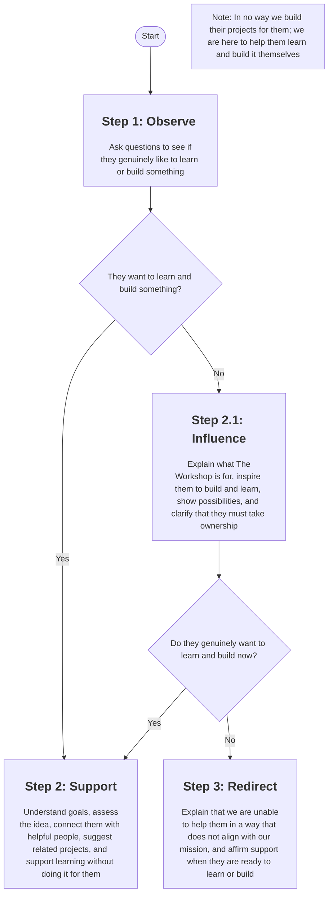

# Handling School Project Requests

## The Workshop is for:

* The Workshop is for people who want to learn how to build something.
* The Workshop is for people to experience the joy of building and creating things.
* The Workshop is for people who want to explore an idea.
* The Workshop only builds with purpose, we only build solutions that we believe would benefit people.
* The Workshop is NOT a place to skip learning a concept someone is expected to learn.
* The Workshop may provide paid development services to partners who aim to solve real world problems.

## Schedule


In the future, we might enforce specific schedules/window on when we can accept new projects, this is to help our community members focus on their community projects. Please reach out to the Governance Team if you think this is needed to be setup soon.


## Help when able

Note that we are not obligated to help every single person that asks for help in The Workshop. Help when able, look for people who can help them. Prioritize helping by providing them with resources they can use to learn it on their own. Use your best judgement when you need to help others extensively. Be respectful and understanding at all times.

***

## Assessing how to handle a new Project

Below is a step by step process to assess if a project is good or not, it may not cover all of the scenarios so trust your judgement. Just remember what The Workshop is for.

### Step 1: Observe

* [ ] Are they excited?
* [ ] Are they curious?
* [ ] Do they know what they want?
* [ ] Do they want to learn?
* [ ] Do they genuinely want to build something?
* [ ] Do they have ideas they want to explore?

Example questions you can ask them to know more

> What would you like to build?

> Why do you want to build this?

> What have you built so far?

> Which part are you stuck with and what have you tried so far?

> Who asked you to build this?

\
Key points here is that check for intent to learn, and check if they actually tried learning what they want to build before. Or desire to learn but not sure where to start.

If they checked at least 2 items here, go to `Step 2: Support`

If they did not check anything, go to `Step 2.1: Influence`

### Step 2: Support

* [ ] Understand their goals
* [ ] Does their idea make sense? Give feedback if needed
* [ ] Connect them with the right people who understand or can help them
* [ ] Find similar projects they can leverage or contribute to
* [ ] Help them learn if you have capacity
* [ ] You should NOT do something for them without their active participation and learning.

<table data-card-size="large" data-view="cards"><thead><tr><th></th><th></th><th></th><th></th><th data-hidden data-card-target data-type="content-ref"></th></tr></thead><tbody><tr><td><h2><i class="fa-link">:link:</i></h2></td><td><h4>Connect with existing projects</h4></td><td>Check for existing community projects that might relate to their need, and see if they can become a contributor.</td><td><a href="https://innovationlabs.ph/projects">Community Projects</a></td><td><a href="https://www.innovationlabs.ph/projects">https://www.innovationlabs.ph/projects</a></td></tr><tr><td><h2><i class="fa-compass">:compass:</i></h2></td><td><h4>Welcome our new Explorer!</h4></td><td>This visitor is likely now an <code>Explorer</code>, share this guide with them so they know how to be become part of the community.</td><td><a data-mention href="https://app.gitbook.com/s/64iXsyuGmiAfRoWPjIw2/tiers/explorer/welcome-to-the-workshop">Welcome to The Workshop!</a></td><td><a href="https://app.gitbook.com/s/64iXsyuGmiAfRoWPjIw2/tiers/explorer/welcome-to-the-workshop">Welcome to The Workshop!</a></td></tr><tr><td><h2><i class="fa-shield-check">:shield-check:</i></h2></td><td><h4>Handling Guests and Explorers</h4></td><td>By accepting this guest, you are responsible for ensuring that The Workshop continuous to be safe for our people and resources. Read the guide.</td><td><a data-mention href="handling-guests-and-explorers.md">handling-guests-and-explorers.md</a></td><td></td></tr></tbody></table>

### Step 2.1: Influence

* [ ] Explain what The Workshop is for
* [ ] Excite them about building and learning, explore ideas, show projects, show what’s possible
* [ ] Make it clear that we are only able to help them if they will be the main actor and they will learn what they need to learn.
* [ ] Redo Step 1: Observe and offer help IF ONLY they now genuinely pass at least 2 criteria on Step 1: Observe. Proceed to Step 2: Support.
* [ ] If they still did not show the signs we’re looking for, proceed to Step 3: Redirect

### Step 2.1.1: Redirect

* [ ] Explain what The Workshop is for
* [ ] Explain that we are unable to provide services outside our mission
* [ ] Provide affirmation that The Workshop is here for them if they have an idea, want to learn, etc..

## Check your understanding


This assessment is required for you to start accepting guests at the workshop



