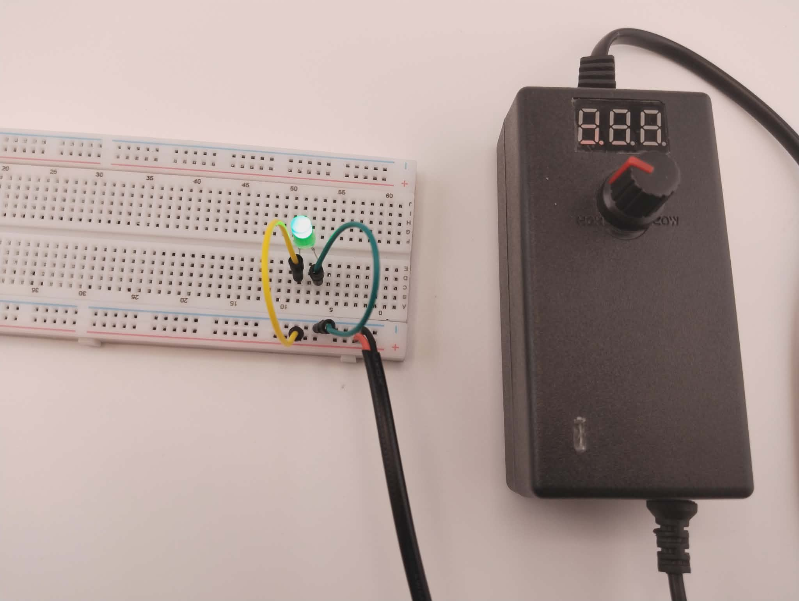
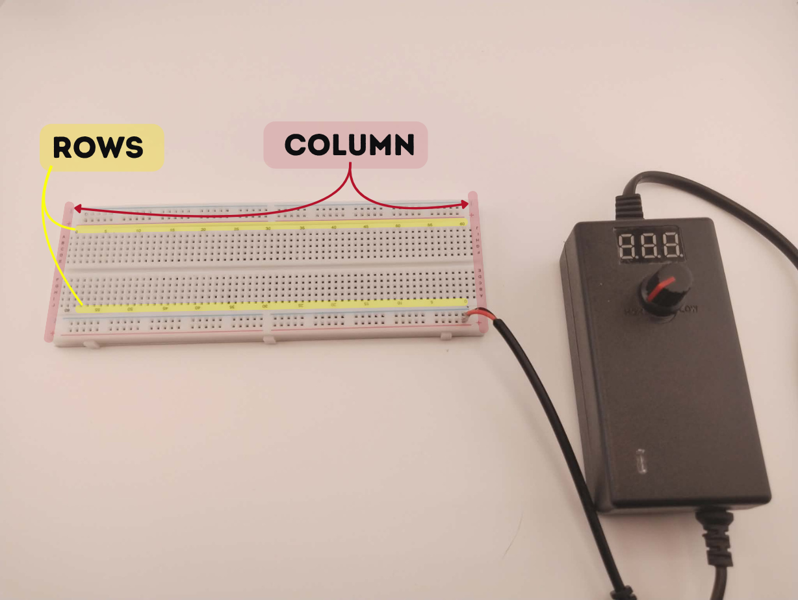
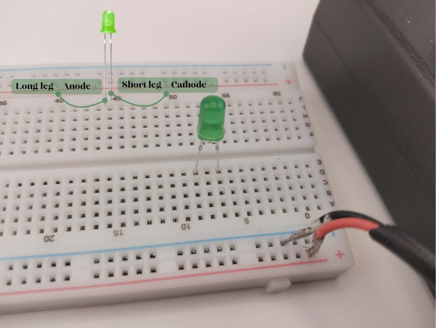
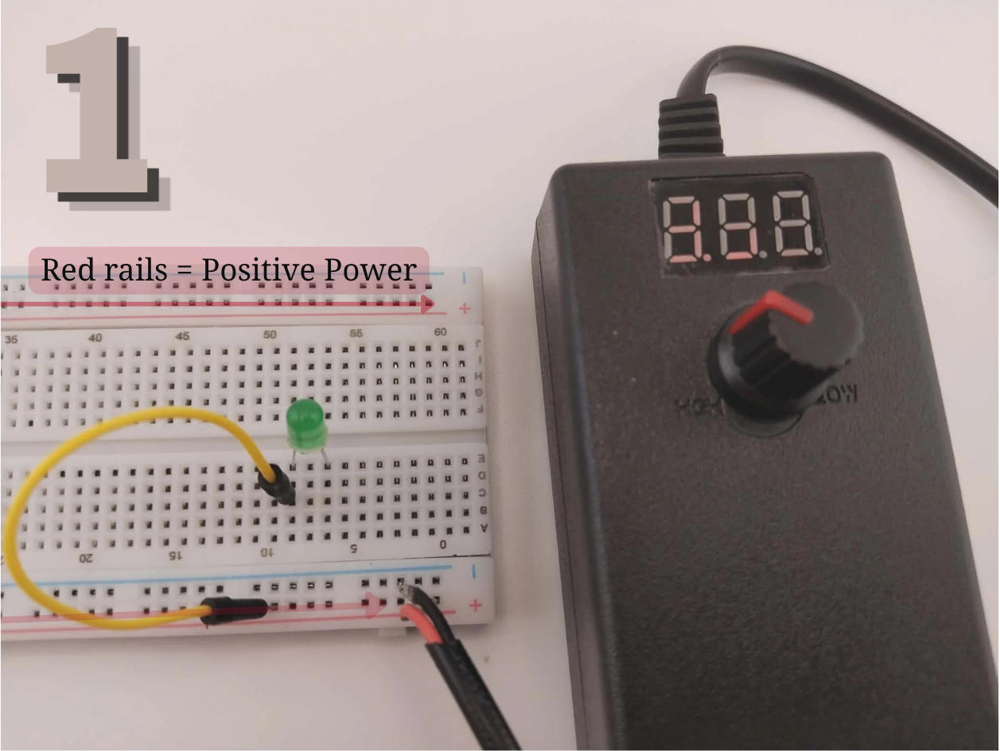
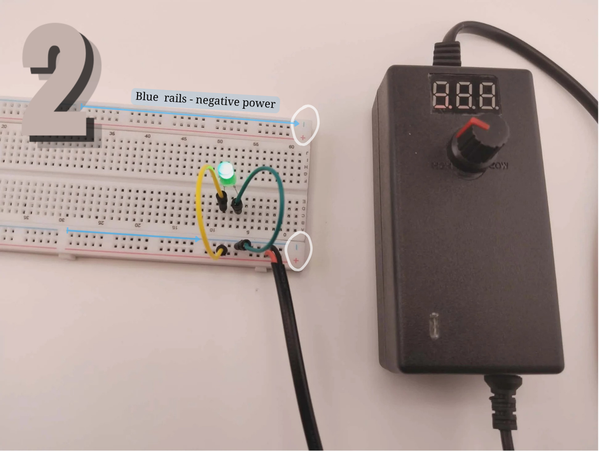
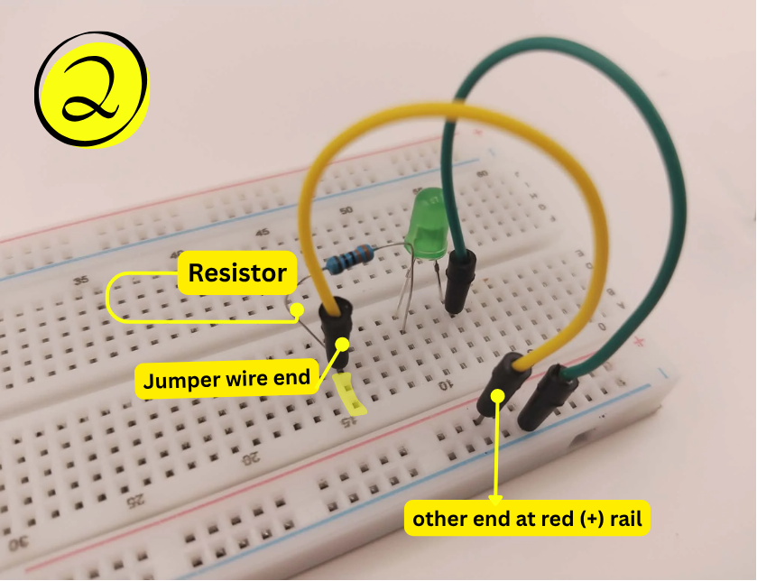

# 💡 Light Post with Breadboard

<h2 align="center"><mark style="color:$primary;">Your output will look like this</mark> <i class="fa-arrow-down" style="color:$primary;">:arrow-down:</i></h2>

<figure><figcaption></figcaption></figure>

### <mark style="color:$primary;">**Preparation**</mark>

<table><thead><tr><th align="center">COMPONENT</th><th width="224.84912109375" align="center">VISUAL REFERENCE</th></tr></thead><tbody><tr><td align="center">LED</td><td align="center"></td></tr><tr><td align="center">Adjustable Power Supply</td><td align="center"></td></tr><tr><td align="center">Breadboard</td><td align="center"></td></tr></tbody></table>

***



## <mark style="color:$primary;">Step 1: Connect the Power Supply</mark>

<figure><figcaption></figcaption></figure>

**Step:** Firmly plug the male connector into the female jack to connect your power supply.

**What to notice:** Look closely at your board: the numbers and letters are like a map to guide you. They don't change how electricity flows, but they make it much easier to plug components into the right spots!



## <mark style="color:$primary;">Step 2: Connect the LED to the Breadboard</mark>

<figure><figcaption></figcaption></figure>

* separate the legs of the LED and connect the long leg to Row 9, column E.
* connect the short leg to Row 7, column E

**What to notice:** Make sure to plug the LED legs into two different rows (like Row 9 and Row 7). Each row has its own separate metal clip; if you plug both legs into the same row, the electricity will bypass the LED entirely, causing a short circuit.



## <mark style="color:$primary;">Step 3: Powering the Circuit</mark>

<figure><figcaption></figcaption></figure> <figure><figcaption></figcaption></figure>

**First Jumper Wire:** Connect one end of a jumper wire to the same row as the long leg of the LED (Row 9) and the other end to the positive power rail (red line).

\
**​Second Jumper Wire:** Grab a second jumper wire and connect one end to the same row as the short leg of the LED (Row 7). Connect the other end to the negative power rail (blue line).

\
**​Turn on Power:** Slowly turn the voltage knob clockwise until the display approximately reads 3.0V. Your LED should light up!

**​What to notice:** The long columns on the far sides are Power Rails. Inside the board, all holes in a power rail are connected _vertically_, acting like an extension cord to deliver power to your rows.

***

<h3 align="center"><mark style="color:$success;">Yey! Another trophy for you! You are so amazing.</mark> 🏆</h3>



***



## <mark style="color:$primary;">**Output**</mark>

<figure><figcaption></figcaption></figure>

## <mark style="color:$primary;">**Pictorial Diagram**</mark>

***

<figure><figcaption></figcaption></figure>

_Follow these steps to safely connect your components and complete the circuit loop:_



## <mark style="color:$primary;">Step 1: Connect LED</mark>

<figure><figcaption>
edit photo add anode cathode 
</figcaption></figure>

* Connect the long leg in Row 10, Column E, with the short leg in Row 7, Column E.



## <mark style="color:$primary;">Step 2: Add the Resistor</mark>

<figure><figcaption>
resistor 33oohm, add zoom color
</figcaption></figure>

* Attach the other end of the resistor to the next hole down in Row 10, Column D, next to the long leg, and connect the other end to Row 14, Column D.



## <mark style="color:$primary;">Step 3: Add a Jumper Wires</mark>

<figure><figcaption></figcaption></figure>

1. Connect a jumper wire to the **same row as the LED's short leg (cathode)**. Connect the other end of the wire to the **blue (-) rail**.
2. Take another jumper wire. Connect one end to the **same row as the resistor lead**. Connect the other end to the **red (+) rail**.



## <mark style="color:$primary;">Step 4: Add the battery</mark>

<figure><figcaption></figcaption></figure>

<figure><figcaption></figcaption></figure>

***


