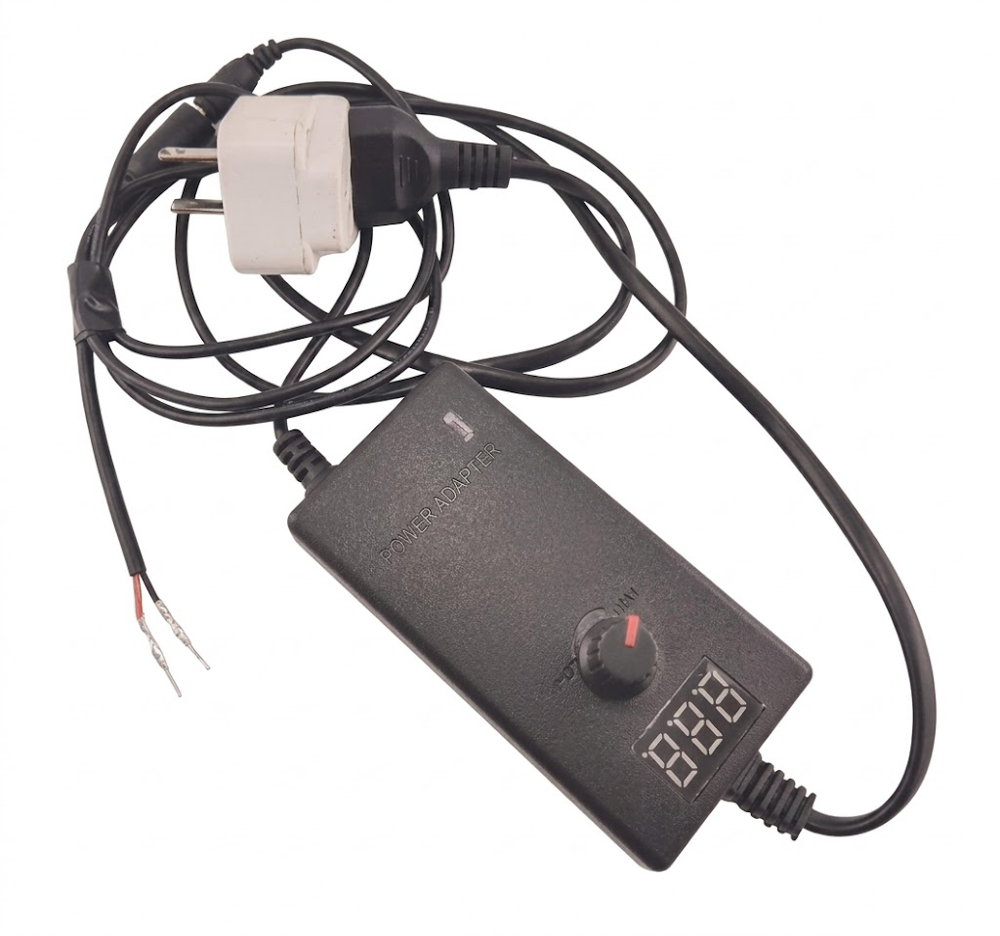

# 💡 Light Post with Breadboard

<h2 align="center"><mark style="color:$primary;">Your output will look like this</mark> <i class="fa-arrow-down" style="color:$primary;">:arrow-down:</i></h2>

<figure><figcaption></figcaption></figure>

### <mark style="color:$primary;">**Preparation**</mark>

<table><thead><tr><th align="center">COMPONENT</th><th width="231.7061767578125" align="center">VISUAL REFERENCE</th></tr></thead><tbody><tr><td align="center">LED</td><td align="center"></td></tr><tr><td align="center">Adjustable Power Supply</td><td align="center"></td></tr><tr><td align="center">Breadboard</td><td align="center"></td></tr><tr><td align="center">Jumper Wire</td><td align="center"></td></tr><tr><td align="center"></td><td align="center"></td></tr></tbody></table>

***

### <mark style="color:$primary;">How to use breadboard?</mark>



## <mark style="color:$primary;">Step 1: Connect the Power Supply</mark>

<figure><figcaption></figcaption></figure>

**Step:** Firmly plug the power supply breadboard.

**What to notice:** Look closely at your board: the numbers and letters are like a map to guide you. They don't change how electricity flows, but they make it much easier to plug components into the right spots!



## <mark style="color:$primary;">Step 2: Connect the LED to the Breadboard</mark>

<figure><figcaption></figcaption></figure>

* separate the legs of the LED and connect the long leg to Row 9, column F.
* connect the short leg to Row 7, column F

**What to notice:** Make sure to plug the LED legs into two different rows (like Row 9 and Row 7). Each row has its own separate metal clip; if you plug both legs into the same row, the electricity will bypass the LED entirely, causing a short circuit.



## <mark style="color:$primary;">Step 3: Powering the Circuit</mark>

<figure><figcaption></figcaption></figure> <figure><figcaption></figcaption></figure>

**First Jumper Wire:** Connect one end of a jumper wire to the same row as the long leg of the LED (Row 9) and the other end to the positive power rail (red line).\
**​Second Jumper Wire:** Grab a second jumper wire and connect one end to the same row as the short leg of the LED (Row 7). Connect the other end to the negative power rail (blue line).\
**​Turn on Power:** Slowly turn the voltage knob clockwise until the display approximately reads 3.0V. Your LED should light up!

**​What to notice:** The long columns on the far sides are Power Rails. Inside the board, all holes in a power rail are connected _vertically_, acting like an extension cord to deliver power to your rows.

***

<h3 align="center"><mark style="color:$success;">Yey! Another trophy for you! You are so amazing.</mark> 🏆</h3>



***



#### Question 1

​Look closely at how the LED is plugged in during Step 2. Why can't you plug both the long leg and the short leg into the same row (for example, both in Row 9)?

* [ ] A) The LED will get too much power and burn out.
* [ ] B) The legs won't fit into the holes together.
* [x] C) The electricity will bypass the LED entirely through the row's internal metal clip, causing a short circuit.

#### ​Question 2

​Which part of the breadboard acts like a vertical "extension cord" to deliver power down the entire length of the board?

* [ ] A) The center trench.
* [ ] ​B) The lettered columns (A–E).
* [x] ​C) The long power rails on the far sides (marked with red and blue lines).

#### ​Question 3

​If you want to look at your breadboard like a map to find specific holes, which features should you use to guide you?

* [ ] A) The colors of the jumper wires.
* [x] ​B) The numbers and letters printed on the board.
* [ ] C) The size of the power supply knob.

ANSWER KEYS

1. C
2. C
3. B

